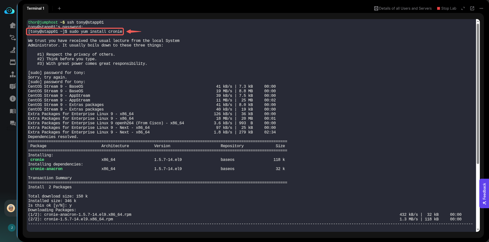
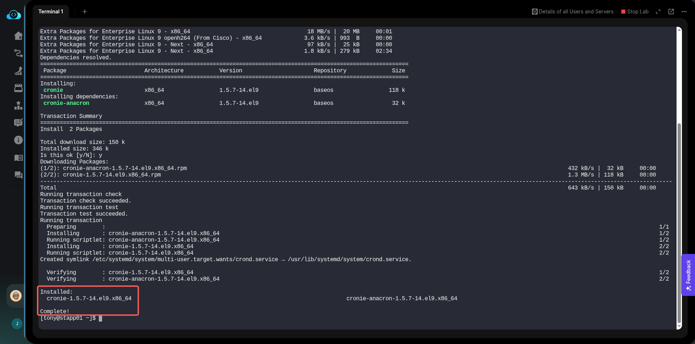
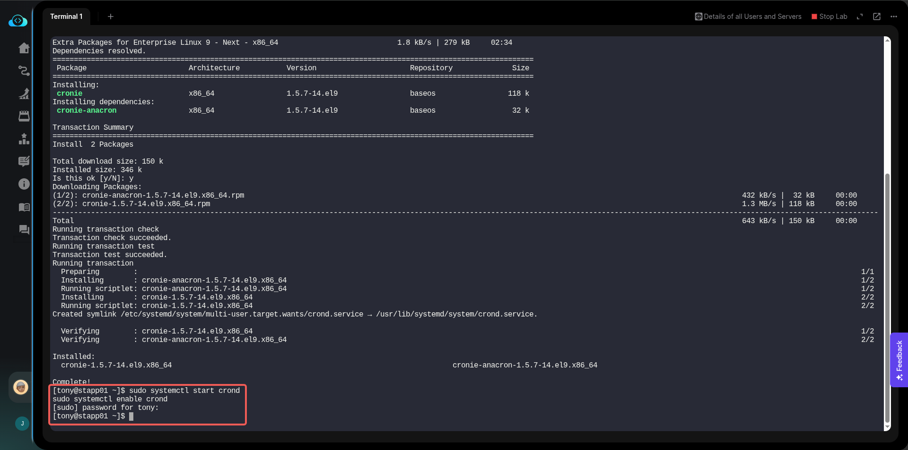
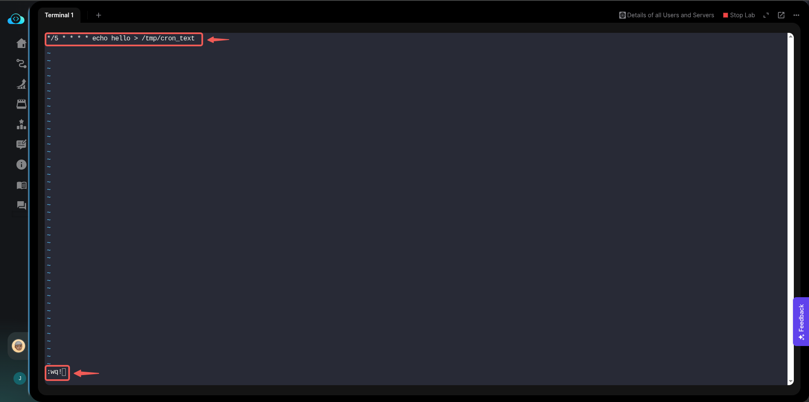
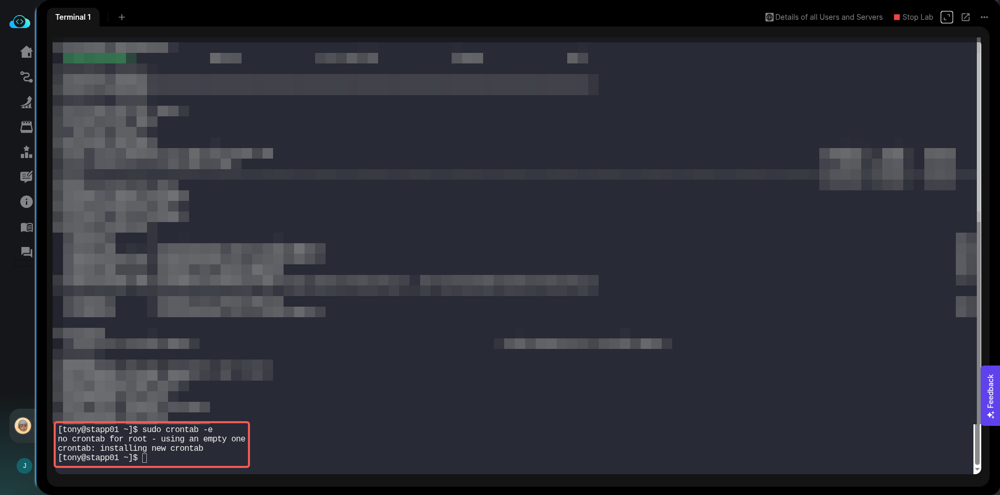
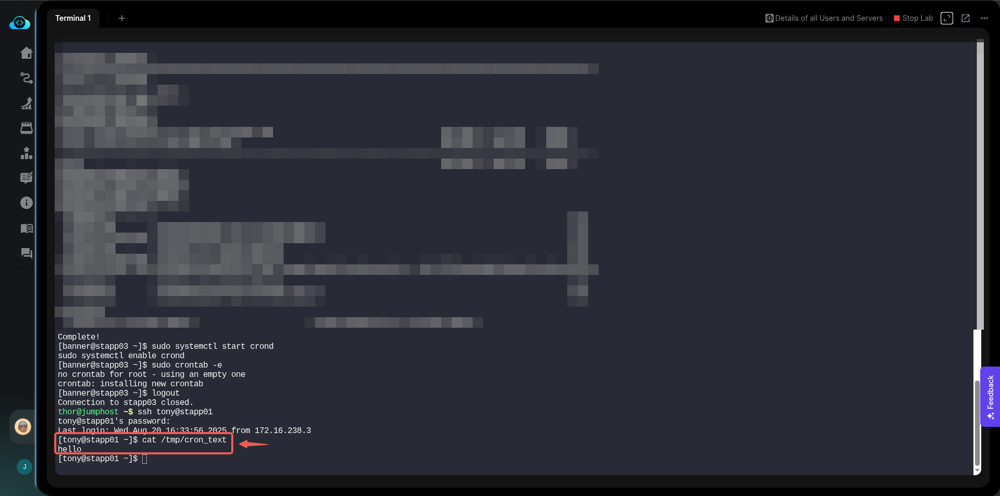

# Task

Create a Cron Job

## Task Details

The Nautilus system admins team has prepared scripts to automate several day-to-day tasks. They want them to be deployed on all app servers in Stratos DC on a set schedule. Before that they need to test similar functionality with a sample cron job. Therefore, perform the steps below:

a. Install cronie package on all Nautilus app servers and start crond service.


b. Add a cron */5 * * * * echo hello > /tmp/cron_text for root user.

### Solution

To install the cronie package and set up a cron job on all Nautilus app servers, you'll need to follow a few key steps on each server.

a. Install `cronie` and Start `crond` Service.

- Install **`cronie`** by running the following command: **`sudo yum install cronie`**.





- Start and enable `crond`: Once the package is installed, use **`systemctl`** to start the service and ensure it runs automatically on boot.

```
sudo systemctl start crond
sudo systemctl enable crond
```



---

b. Add a Cron Job for the Root User

To add a cron job for the root user, you can use the crontab -e command.

- Open the root user's crontab by using sudo to edit the crontab: **`sudo crontab -e`**.

- Insert the following line into the crontab file. This command will execute every five minutes, writing the word "hello" into a file named cron_text in the /tmp/ directory.

**`*/5 * * * * echo hello > /tmp/cron_text`**.



And then save and exit: **`:wq!`**.



> [!NOTE]
repeat these steps for every app server. logout of the stapp01, ssh into stapp02 and repeat the steps, also do the same for stapp03.

To verify that the cron job is working correctly, you can check the content of the file that the cron job is supposed to be writing to. In this case, the file is **/tmp/cron_text**.

- The cron job **`*/5 * * * * echo hello > /tmp/cron_text`** is set to run every five minutes. Wait for at least five minutes after saving the crontab entry to allow the job to execute.

- Use the cat command to view the contents of the file /tmp/cron_text: **`cat /tmp/cron_text`**.

If the cron job is running successfully, the output of this command will be: **hello**.



---