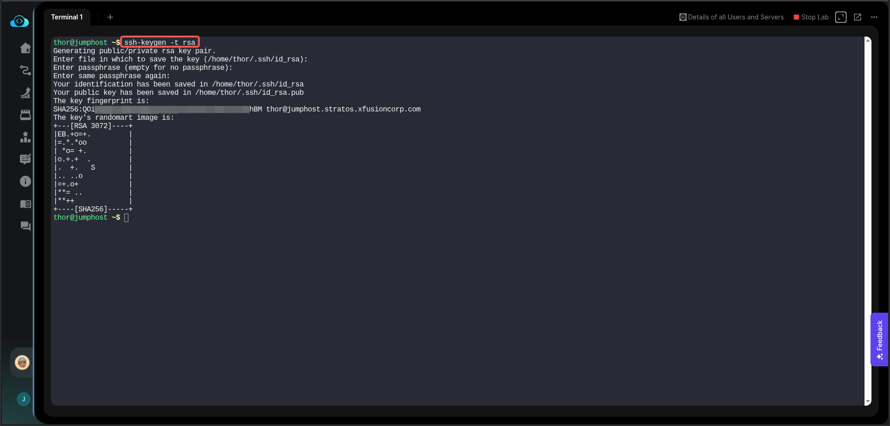
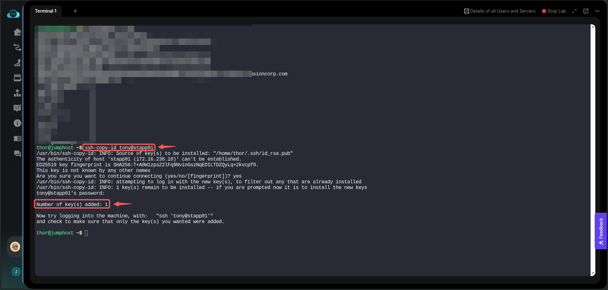
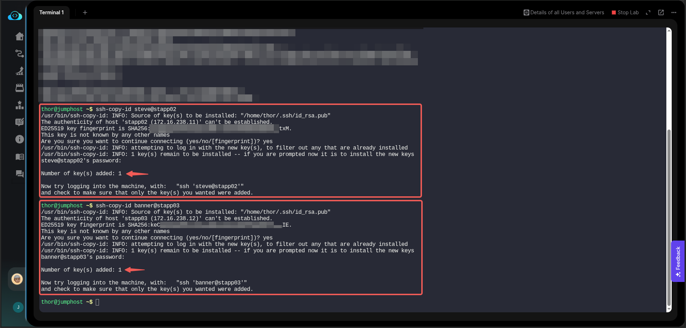
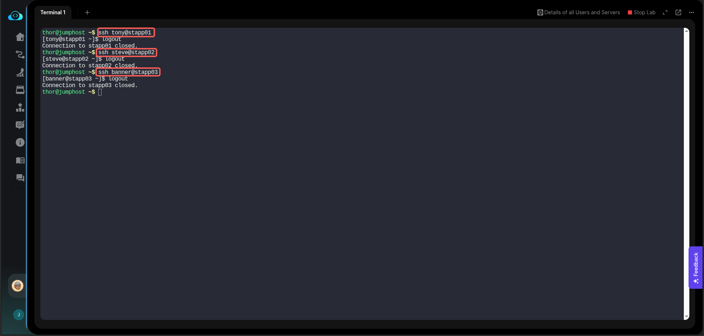
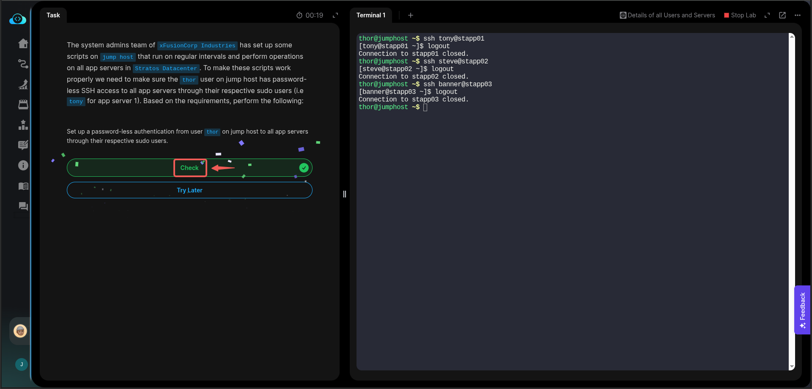

# Task

Linux SSH Authentication

# Task Description

The system admins team of xFusionCorp Industries has set up some scripts on jump host that run on regular intervals and perform operations on all app servers in Stratos Datacenter. To make these scripts work properly we need to make sure the thor user on jump host has password-less SSH access to all app servers through their respective sudo users (i.e tony for app server 1). Based on the requirements, perform the following:

Set up a password-less authentication from user thor on jump host to all app servers through their respective sudo users.

# Solution

- Generate a keypair on the jumphost by running the **`ssk-keygen`** command.



- Copy the generated key to all app servers:

```
ssh-copy- id tony@stapp01
ssh-copy- id steve@stapp02
ssh-copy- id banner@stapp03
```




- To test the setup, ssh into each app server without a password.



Task Complete!


